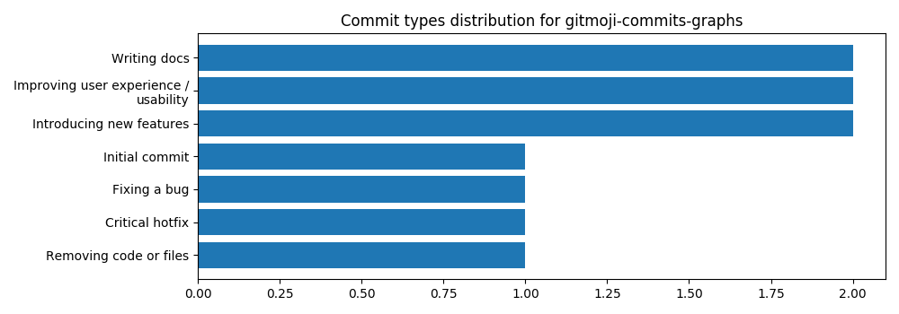

# gitmoji-commit-graphs
> Generate a distribution graph of different commit types for repositories following the gitmoji standard. 

Tested on WSL (Ubuntu 18.04) and Windows 10. The last step (opening the graph) will not work on linux, but the fix is trivial.

Here's the graph of this repository (at commit `544eb3f1f4e02850c2e175ca6f7ae5a27eac0792`)

```bash
$ commit-types-distribution -o example.png
```



## Some usage `--help`
```
usage: commit-types-distribution [-h] [--show-non-gitmoji] [--emoji-labels]
                                 [-o PATH] [-f] [-m PATH|URL]
                                 [--save-gitmoji-map]
                                 [PATH]

Generate a bar plot showing distribution of commit types. Intended for use on
repositories following the gitmoji standard.

positional arguments:
  PATH                  The path to the repository to analyze. Default to the
                        current working directory.

optional arguments:
  -h, --help            show this help message and exit
  --show-non-gitmoji, -G
                        Show a "N/A" bar counting commits that don't start
                        with an emoji.
  --emoji-labels, -e    Use emojis for labels (Broken right now)
  -o PATH, --output-file PATH
                        Graph output filepath.
  -f, --open-file       Open the file
  -m PATH|URL, --gitmoji-map PATH|URL
                        The file to use as the gitmoji map. Must be a JSON
                        object using the same schema as the default map.
                        Default: https://raw.githubusercontent.com/carloscuest
                        a/gitmoji/master/src/data/gitmojis.json
  --save-gitmoji-map    Prints the gitmoji map JSON file from the official
                        gitmoji repository and exit. Use this to save a local
                        version
```
